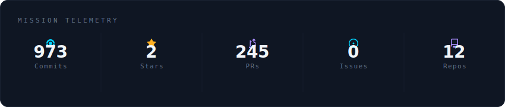

<!-- Galaxy Profile README
     Auto-generated by galaxy-profile generator -->

  

 

  

 

  

 

  

 

<strong>More about me</strong>

 

Master's Student In Communication and Web Technologies, Grant Researcher, Frontend Developer

**Currently at** University of Aveiro

Currently working on Ser+ Mobile App

 

  
  

